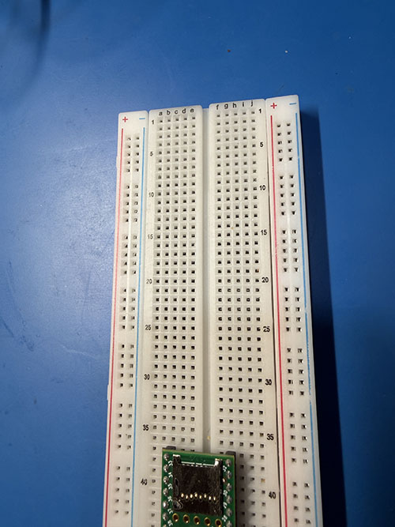
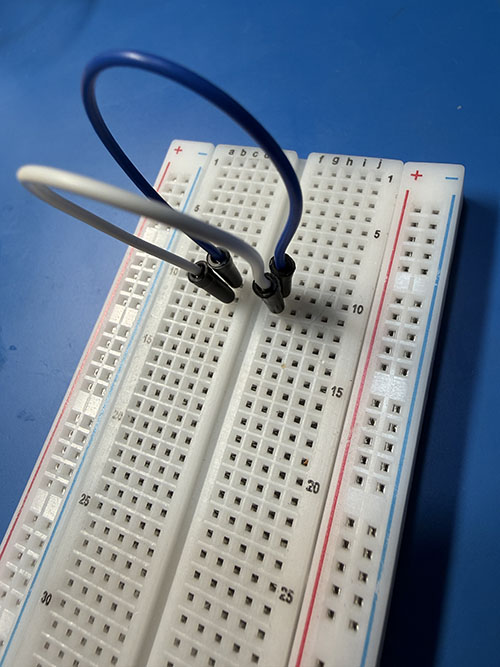
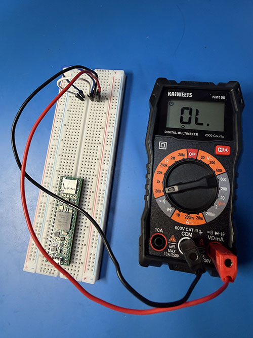
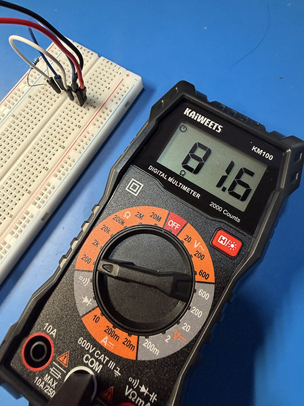
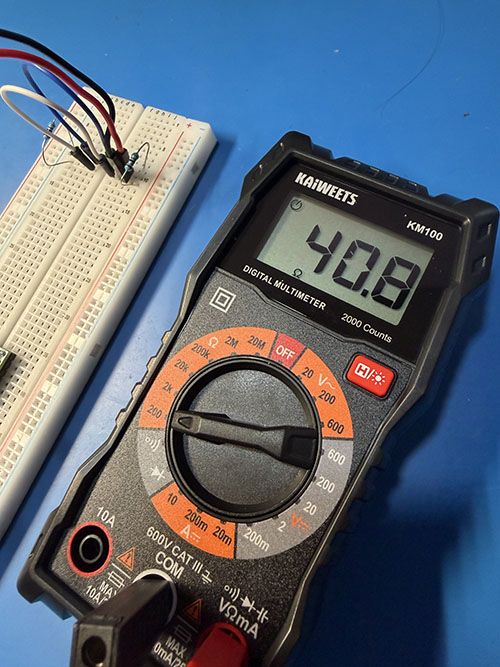
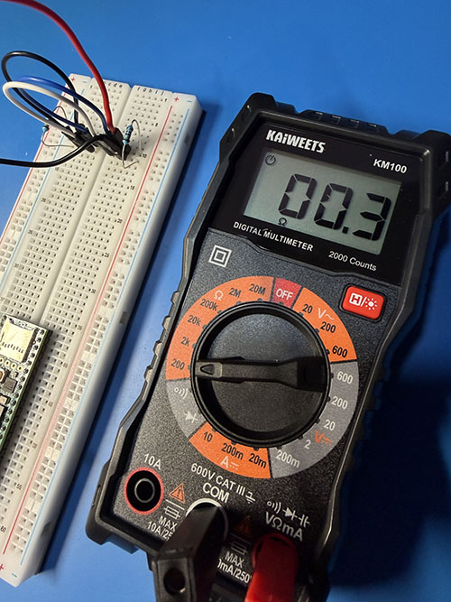

[//]: # (Lab_03.md)
[//]: # (Copyright © 2026 Joel A Mussman. All rights reserved.)
[//]: #

# Explore1553 Lab 3: Simulate a physical bus network and check its characteristics

\[ [Link to Lab contents](./README.md#labs) \]

## Hardware Required

1. 6-inch breadboard (if the Teensy 4.1 is already mounted that is OK).
    *Do not touch this without anti-static protection!*
1. Short-length breadboard jumper wires.
1. Two 81-ohm resistors.
1. Multimeter and test leads (pin-tipped leads are preferred).

## Lab Steps

Note: in the classroom environment the breadboards are usually set up before class with the Teensy 4.1 microcontrollers put in place.
This is simply to avoid over-handling the Teensy and breaking pins, etc.
When using non-classroom equipment (your own) you can place the Teensy when you reach the corresponding lab.

1. Set up the anti-static mat and connect the ground cable to the same electrical ground as the power
    for the computer.
    It does not have to be the same power receptacle, just on the same electrical circuit.
    Use a tester to see if the ground pin in the outlet is actually connected to ground; if it is not
    find another circuit for the computer and the anti-static mat.
    This is important, because the electronics will be grounded to the computer when the USB
    cables are plugged in, the mat needs to be grounded to the same circuit, and an ungrounded circuit
    wil...
1. Make sure to always wear the wrist-strap and have it connected to the anti-static mat when
    working with electronics.
    Failure to observe this will cause voltage to cross the sensitive electronics when it is
    picked up and handled, because the voltage always wants to stabilize.
    The voltage surge can burn out the electronics.
    When connected to the mat and touching objects on the mat, the voltage is already stabilized
    across everything.
1. The breadboard is a device that integrated circuit boards and jumper wires may be plugged into.
    It is organized by numbered horizontal rows and vertical columns.
    The sockets in the + & - vertical columns at the right are connected in a vertical line and
    intended to be used as a power bus (not necessary for this lab).
    The sockets in the numbered rows are connected horizontally in each row.
    The valley in the middle breaks the horizontal connection into a left and right side.
    The vertical columns on the main board are not connected, but the letters a-j can
    be used to refer to a particular socket in a particular row (column first): e.g. A10 or B10.
      
1. Pick a short breadboard jumper wire.
    The color does not really matter, but we like blue because it is the center wire in a triaxial cable.
1. Put one end of the wire in E10 and other end in F10 to electrically connect the two halves of the row.
1. Pick another jumper wire (white is the other triaxial color) and connect E11 and F11.
    Now row 11 is also connected all the way across.
      
1. Plug the test leads into the multimeter.
    The positive lead (often red) will go in the socket marked for Ohms (&Omega;).
    The negative lead will go to the Common Ground.
1. If there are pin-tipped leads for the multimeter, connect the positive to H10 and the negative to H11.
    If there are alligator-clips, put jumper wires (any color, but we like red and black) into H10 and H11 and connect the
    clips to them.
    If the leads have neither pin-tips or alligator-clips, put the jumper wires in place and the leads will have to be touched to the wires manually to get a reading.
      
1. Turn the multimeter to &Omega; setting.
    If your multimeter is scaled, put it at a low setting where values like 40 &Omega; and 80 &Omega; will be visible:
1. Take a reading.
    If the multimeter leads are not pin-tipped or alligator-clips manually touch the appropriate jumper wires: positive (&Omega;) to the wire in
    H10 and ground to the wire in H11.
    What is the Ohm level on the multimeter?
1. The reading should be 0 &Omega;: infinite resistance.
    This indicates the two rows are not connected.
    MIL-STD-1533 uses a bus with three wires: blue, white, and ground (the shield in the cable).
    This simulated bus was created using two wires, but
    the unconnected wires are not suitable for sending a signal on.
    While the resistance is infinite, any signal send on the wire will reflect
    at the unconnected end of the wire and the message will be garbled.
1. MIL-STD-1553 solves this problem with terminator resistors at each end of the bus.
    Remove two 82 &Omega; resistors from the anti-static bag.
    Resistors are color coded.
    82 &Omega; is four-color code: Gray, Red, Black, and Gold for a resister with 5% tolerance. The
    tolerance says the resistor will be close to 82 &Omega; within 5% of that value.
    If there are five bands: Gray, Red, Black, Gold, and Brown, then the resistor has 1% tolerance.
    Locate one of the 82 &Omega; resistors.
1. Using the needle-nose pliers so as to not break the resistor leads, place the 82 &Omega; resister at the left size of the bus across sockets A10 and A11.
    The leads on the resistor may need to be bent down first if it has not been used before.
1. Check the meter reading now, what is it?
1. The bus wires are connected by the resistor, and the reading should be close to its value.
    The example in the picture had a little loss, it is: 81 &Omega;
    This was a five-band resistor.
    1% of 82 is .82 and a 1% loss would be 81.18 &Omega;, so 81.6 &Omega; is well within tolerance.
      
1. That only fixed half of the problem.
    The bus needs to be terminated at both ends.
    Add another 82 &Omega; resistor to jump J10 to J11.
1. Take another reading, what do you get?
1. The way electrical circuits work, the value should be cut in half: 40.8 &Omega;:
      

    A MIL-STD-1553 bus uses 78 &Omega; terminators (resistors);.
    The lab chose 82 &Omega; resistors simply because it is very difficult to find the 78 &Omega; resistors.
    82 is just a little higher than 78, but close enough for the simulation.
    From all of this it can be reasoned that on a real MIL-STD-1553 network a check with multimeter should read 39 &Omega;.
1. Add a short jumper wire (any color will do) across C10 and C11.
1. Take an &Omega; reading now, what do you get?
1. An &Omega; reading of zero or close to zero indicates a complete connection without any
    significant resistance on the wire.
    In other words, a short-circuit!
      
1. Remove the short-circuit in C10-C11.

## Conclusions

* When testing a cable all by itself, infinite resistance is a good thing: no short circuits!
* If the reading is close to 0 &Omega;, that means something is shorted out.
* If a connected bus is being tested, look for 1/2 the &Omega; value for the bus: 39 &Omega; on a real
    MIL-STD-1553 bus.
* If the reading with the terminators is wrong, something is causing it:
    * If the reading is twice what is expected, a terminator is missing.
    * If the reading is something else, maybe a terminator died.

   **Congratulations, you have completed this lab!**

  
## Classroom Experiment (Optional)

In the classroom as the whole class group, or on your own if you have the equipment, expand on the lab by checking what happens on
a real MIL-STD-1553 network.

### Hardware:

1. A multimeter with test leads.
1. A TDR cable fault locator with a Ponoma 5299 female TRD to male BNC adapter.
1. Two 0.5-meter triaxial cables.
1. One 3-meter triaxial cable.
1. Two MIL-STD-1553 data couplers.
1. One 78 &Omega; MIL-STD-1553 terminator.
1. A female-female TRD (triaxial bayonet) adapter.
1. A female TRD jack, with three wires connected to center, ring, and ground.
1. A 2mm DB female socket (like those in the female side of a serial or old RGB cable).

### Answer the following questions using the multimeter and the TDR cable fault locator (just swap them for each step):

1. Connect the female jack to a triaxial cable and use the pigtail (the wires) to check the &Omega;.
    What do you get?
    Swap the female jack for the TDR fault locator on the cable.
    What does it show?
1. At the other end of the cable insert the 2mm DB female socket to the side of the center pin (but on it) so that it touches
    the ring around the center and shorts the connector.
    It should just be snug enough to short out the blue and white wires (at the ring).
    Put back the female jack and check the &Omega; what is it now?
    What does the TDR show on the cable?
1. Take off the female socket jumper creating the short, and connect the female-female jack and the terminator to the cable.
    What is the &Omega; reading now?
    And the TDR?
1. Assemble the network: terminator > coupler > 1/2 meter cable > coupler > cable (with the female jack).
    Add a stub cable to the coupler just added.
    What happens for the &Omega; reading now on the bus cable going into the first coupler?
    What does the TDR show?
1. Put the female socket on the other end of the stub cable to short it.
    Check the &Omega; reading on the bus wire into the data coupler.
    What happened there?
    And now the TDR?
1. What conclusions can be drawn from all of this?
